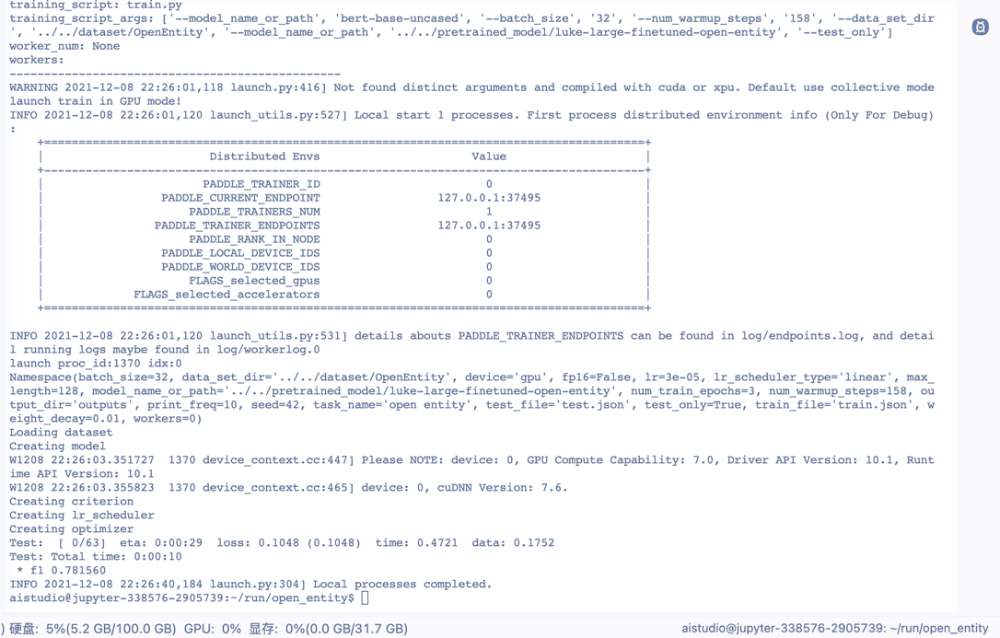
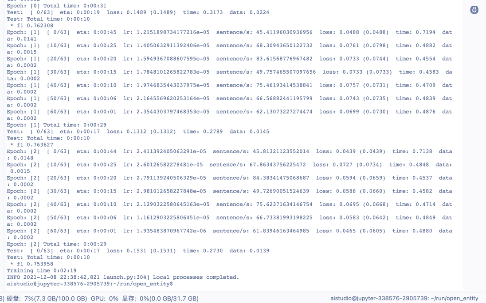
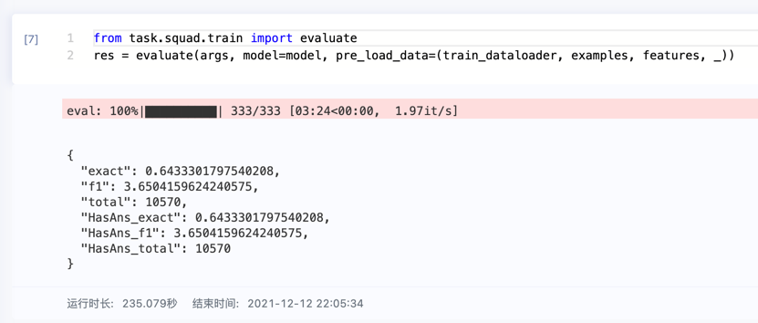

# Paddle-LUKE
Paddle-LUKE


```bash
cd task/open_entity
python -m paddle.distributed.launch --gpus "0" train.py \
    --model_name_or_path bert-base-uncased \
    --batch_size 32 \
    --num_warmup_steps 158 \
    --data_set_dir ../../dataset/OpenEntity \
    --model_name_or_path ../../pd/luke-large-finetuned-open-entity \
    --test_only
```




训练结果


# LukeModel
1. LukeEmbeddings
2. LukeEntityEmbeddings
3. LukeEncoder
   1. LukeLayer
      1. LukeAttention
         1. LukeSelfAttention
         2. LukeSelfOutput
      2. LukeIntermediate
      3. LukeOutput
4. LukePooler


1.Open Entity测试集F1=78.2，
SQuAD1.1测试集F1=95.4，EM=90.2（见论文Table1 & Table5）


SQuad结果

#复现失败