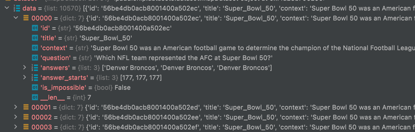
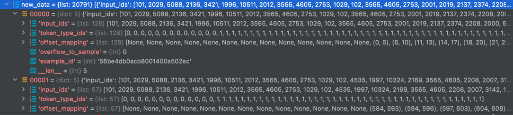
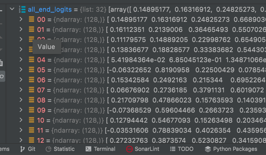

```

word_ids (32,215) pad=1
word_segment_ids (32,215) 貌似全0
word_attention_mask（32， 215） [11110000]
entity_ids (32, 3) pad=0
entity_position_ids (32, 3, 30) 一个实体对应的token位置，连续 pad=-1
entity_segment_ids (32, 3) 貌似全0
entity_attention_mask （32， 3） 实体1 pad=0

word_hidden_states = encoder_outputs[0][:, : word_ids.size(1), :]
取luke对句子的编码，（32， 215， 1024）
将编码输入全链接层，分为2类
logits = self.qa_outputs(word_hidden_states)
（32， 215， 2）

start_logits = start_logits.squeeze(-1)
end_logits = end_logits.squeeze(-1)
每一类分别代表一个位置被识别为start或end的概率

```

```python
all_predictions, all_nbest_json, scores_diff_json = compute_prediction(
        data_loader.dataset.data,
    data_loader.dataset.new_data,
        (all_start_logits, all_end_logits),  
    args.version_2_with_negative,  # false
        args.n_best_size,  # 20
    args.max_answer_length,  #  30
        args.null_score_diff_threshold  # 0.0
)
```


run_squad中，
data_loader.dataset.data为10570的列表


data_loader.dataset.new_data为20791的list





